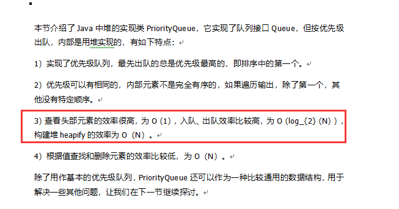

## 2020-03-26：现在我有一个十万大小的数据集，要从中寻找选出最大的10个元素，怎么做呢？

***
福哥答案2020-03-27：  
一次遍历  
或者  
小根堆https://blog.csdn.net/weixin_39411321/article/details/89208219   

评论如下：

群1：

一个男孩-Pouke:

@Shelters 什么原理

 

小萤哥:

@葡萄柠檬我问你的是这些数字会重复么  还有有最大值上限么

 

Chiang:

@葡萄柠檬 forkjoin解决如何？

 

Shelters:

@一个男孩-Pouke 调的是b的实例不是b的代理类

 

一个男孩-Pouke:

@Shelters 50分

 

葡萄柠檬:

原题就是这样，没明确 说明 的

 

一个男孩-Pouke:

@Shelters 面试官不满意

 

Shelters:

...那怎么说

 

葡萄柠檬:

这是字节跳动的

 

_怀瑾握瑜-_:

建立小顶堆

 

没有背景，只有背影:

大佬最优答案是什么呢

 

小萤哥:

无重复数字   有最大上限的条件下  定一组字节，从头到尾读一遍数字，比如是4，就把第四个位通过位运算设置为1，遍历完成后，通过索引就能确定最大的十个数

 

小萤哥:

有重复数字，再记录下最右侧数字的出现次数即可

 

小萤哥:

没有最大上限 通过forkjoin计算

 

冥冥:

应该不是forkjoin的解决办法，这个只是其次

 

小萤哥:

主要是考查位运算的

 

冥冥:

我的理解是，构建一个优先级队列（最大还是最小没想清楚），保存10个，当然可分而治之最后合并更好

 

小萤哥:

内存消耗大，效率不高

冥冥:

@葡萄柠檬 10个长度的最小堆，然后比较，可以分而治之

 

冥冥:

群2：

【来点简单】pig.ac 9:19:12
维护一个堆？

【秒杀一切】Mourinho 9:19:20
分治

【秒杀一切】Mourinho 9:19:31
分成100份

【秒杀一切】刷题废物 9:19:35
快排思想不行么

【秒杀一切】Mourinho 9:19:36
然后每个取钱10个

【冲刺困难】葡萄❤柠檬 9:21:20
这个是字节跳动的面试题

【来点简单】pig.ac 9:23:08
维护一个长度为 10 的小根堆 不断喂不断弹就好了嘛

【秒杀一切】Mourinho 9:23:46
是的

【秒杀一切】Mourinho 9:24:04
小根堆代码手写起来  面试估计还是有点慢的

【群主】lucifer(e签宝招人) 9:25:18
10w 才几M而已， 直接上堆就可以

 

群3：

【活跃】哦，wonder 9:20:29

堆排序呗

 

【活跃】哦，wonder 9:20:40

小根堆

 

【潜水】堂风、、 9:48:05

定义10个变量，遍历数据集一次，取数与10个变量最小的比较，10个记录存储的时候小的置于顶端

 

【活跃】哦，wonder 9:49:03

不就是堆吗？

 

【吐槽】Paraoia 9:50:31

sort取，top10。10w秒秒钟出吧。。

 

【潜水】堂风、、 9:52:04

问题是你要不要对数据进行排序

 

【吐槽】Paraoia 9:53:03

10n和nlog10

 

【吐槽】Paraoia 9:53:07

区别不大

 

【吐槽】Paraoia 9:57:47

好了问题改一下一千万亿个数据，找top 1w

 

【潜水】堂风、、 9:59:22

这个故事告诉我们录入的时候不做索引以后会有问题的

 

群4：
百因必有果:

二分法排序

 

初:

无序查找

 

何云威:

分片查找

 

Juju🤔:

最大的十个，遍历一遍就可以了啊

 

&nbsp;:

先排序，然后取出前十个可以吗？

 

何云威:

10万条数据集呢，你排序得要多大的内存和cpu，分成小片排序，然后找出每个小片中最大的值，然后再排序

 

葡萄柠檬:

不用排序的

 

葡萄柠檬:

遍历一次就行

 

Leo:

这种题目都是限制了内存大小的比如只有10m内存给你用，但是数据有几个g

 

&nbsp;:

遍历一次可以吗？

 

&nbsp;:

遍历的时候需要比较大小吗？

 

葡萄柠檬:

需要比较

 

何云威:

我觉得直接遍历然后比较大小，效率不高啊

 

Juju🤔:

o（n）

 

何云威:

这种题目肯定有限制的

 

葡萄柠檬:

10万数量并不大。如果更大数量，要forkjoin了

 

何云威:

如果没限制咋弄都行

 

Juju🤔:

这个题目不需要排序的

 

chashion:

海量数据topK问题

 

chashion:

https://blog.csdn.net/huaijiu123/article/details/82426926

 

Juju🤔:

是的，K不确定的话还是要用堆的

 

群5：

每日一题Lr、:

@葡萄柠檬 这一题有点意思。有没有什么思路

 

葡萄柠檬:

我目前想到的是准备一个能保存十个数字的队列，然后遍历十万的数据，谁小于队列的最小值，就push进去

 

每日一题Lr、:

🤔

 

每日一题Lr、:

有点不太巧

 

葡萄柠檬:

比排序好

 

每日一题Lr、:

倘若这个数据集一变大，效率很不高

 

葡萄柠檬:

大数据量得forkjoin了

 

每日一题Lr、:

🤔

 

每日一题Lr、:

[聊天记录]

 

每日一题Lr、:

@葡萄柠檬

 

每日一题Lr、:

这个最大堆有点意思

 

葡萄柠檬:

是啊

 

杨阿啊:

很多答案啊

 

杨阿啊:

直接最大堆或者 哈希之后最大堆

 

杨阿啊:

你们这是准备面试么  阿里一面被问到过这个问题

 

Lr、:

还有一题是这样的。

 

现在有10亿个电话号码，如何判断10个号码，是否存在这个10亿电话号码中